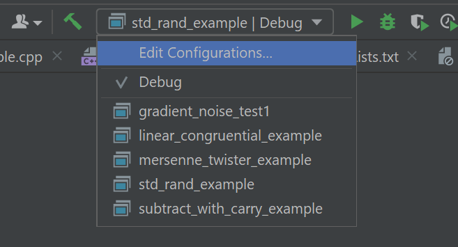

# APC-randomness


## True randomness and how to get it

Random number generation is a tough if not impossible thing to do. That’s why we have the best next thing, pseudorandom number generators. You’ll learn why the C library rand() is not random at all and what alternatives there are. You’ll investigate the properties of different pseudorandom numbers generating algorithms, find out what cryptographically-strong PRNGs are and be able to show really cool looking graphs for others to admire! And of course you’ll add a couple of new terms to your vocabulary like Mersenne Twister or permuted congruential generator that are guaranteed to impress just about everybody during a family dinner.

## Project use explanation

This project has an executable for each example, this way you can try different examples and compare their behaviour. For example, to run the std_rand example executable: go to the configuration drop-down in CLion and select `std_rand_example`.



## Different random number generating methods

Random number engines generate pseudo-random numbers using seed data as [entropy](https://en.wikipedia.org/wiki/Entropy) source. Several classes of pseudo-random number generation algorithms are implemented as templates that can be customized. 

The choice of which engine to use involves a number of tradeoffs: the linear congruential engine is moderately fast and has a very small storage requirement for state. The lagged Fibonacci generators are very fast even on processors without advanced arithmetic instruction sets, at the expense of greater state storage and sometimes less desirable spectral characteristics. The Mersenne twister is slower and has greater state storage requirements but with the right parameters has the longest non-repeating sequence with the most desirable spectral characteristics (for a given definition of desirable).

## RNG engine summary

| engine                                                                                      | name in `<random>`         | Speed     | Storage     | Characteristics                    | Randomness comment                                                                                                |
|---------------------------------------------------------------------------------------------|----------------------------|-----------|-------------|------------------------------------|-------------------------------------------------------------------------------------------------------------------|
| [Linear Congruential](https://en.wikipedia.org/wiki/Linear_congruential_generator)          | linear_congruential_engine | 🔥        | very little | Fast and easy, highly configurable | Period length is parameter dependant, smaller initialization polynomials can reduce the period length drastically |
| [Mersenne Twister](https://en.wikipedia.org/wiki/Mersenne_Twister)                          | mersenne_twister_engine    | Moderate  | A lot       | "Damn"                             | Period length is chosen to be a Mersenne prime                                                                    |
| [Subtract with carry / Lagged Fibonacci](https://en.wikipedia.org/wiki/Subtract_with_carry) | subtract_with_carry_engine | Very fast | Greater     | "Meh"                              | Maximum period of (2k − 1)×2M-1 or y = xk + xj + 1                                                                |

## In-depth overview of RNGs

### Linear Congruential

The linear congruential random number generation uses a piecewise linear function (AKA several linear formulas, the one being used is dependent on parameters provided to the function). For the LCG, this formula is the following:
```
X(n+1) = (aXn + c) % m
```
where: 
- m: modulus
- a: multiplier
- c: increment
- X0: start value

Here's what that formula could look like as a Python function:
```py
from typing import Generator

def lcg(modulus: int, a: int, c: int, seed: int) -> Generator[int, None, None]:
    """Linear congruential generator."""
    # Returns a generator with pseudo-random numbers
    while True:
        seed = (a * seed + c) % modulus
        yield seed
```

Here is an example of the output of this function with different parameters:


### Mersenne Twister

The mersenne twister random number generator gets it name from using the Mersenne prime (2<sup>19937</sup> - 1) for calculating the next batch of random numbers. The math behind the Mersenne twister RNG is very abstract and probably beyond the scope of this overview. Nonetheless, we will try to give a basic explanation of the way this algorithm calculates random numbers.

#### Mersenne Twister Algorithm

To establish the initialization stage for the Mersenne Twister, we have to understand what this algorithm does. To visualize this, we made a high-level flow chart showing you the initialization stage and what happens after running the algorithm: 


After deciding on a seed, the initial Mersenne array can be calculated for an array of _n_ values of _w_ bits each. To initialize an array, you start with setting the value of x<sub>0</sub> to be your chosen seed, then you use the following formula to calculate the initial array:

_x<sub>i</sub> = f × (x<sub>i</sub>−1 ⊕ (x<sub>i</sub>−1 >> (w − 2))) + i_

Taking this formula into account in our flow-chart would look like this:


Now that there is an initialized array, we can apply our Mersenne twist onto it to get random numbers. This twist function looks like this:


Taking all of this into account, we get the following flow-chart:


After this, our array result is cascaded into one random number. This transformation looks like this:

y := x ⊕ ((x ≫ u) & d)

y := y ⊕ ((y ≪ s) & b)

y := y ⊕ ((y ≪ t) & c)

z := y ⊕ (y ≫ l)

In this transformation several variables to calculate a final `z`, `x` is the next value from the series, `y` a temporary value and `z` the value returned from the algorithm.

#### Mersenne Twister Coefficients

The behaviour of this twister and cascade is heavily decided by the parameters used, the parameters are described as following:

- w: word size (in number of bits)
- n: degree of recurrence
- m: middle word, an offset used in the recurrence relation defining the series x, 1 ≤ m < n
- r: separation point of one word, or the number of bits of the lower bitmask, 0 ≤ r ≤ w − 1
- a: coefficients of the rational normal form twist matrix
- b, c: TGFSR(R) tempering bitmasks
- s, t: TGFSR(R) tempering bit shifts
- u, d, l: additional Mersenne Twister tempering bit shifts/masks

Examples of these values (for example for MT19937-64):

- (w, n, m, r) = (64, 312, 156, 31)
- a = B5026F5AA96619E916
- (u, d) = (29, 555555555555555516)
- (s, b) = (17, 71D67FFFEDA6000016)
- (t, c) = (37, FFF7EEE00000000016)
- l = 43

Adding this to our flow-chart, we get a global overview of how we get from seed to random number:


An implementation of the Mersenne Twister algorithm in Python could look like [this](https://github.com/yinengy/Mersenne-Twister-in-Python/blob/master/MT19937.py):

```py
# coefficients for MT19937
(w, n, m, r) = (32, 624, 397, 31)
a = 0x9908B0DF
(u, d) = (11, 0xFFFFFFFF)
(s, b) = (7, 0x9D2C5680)
(t, c) = (15, 0xEFC60000)
l = 18
f = 1812433253


# make an array to store the state of the generator
MT = [0 for i in range(n)]
index = n+1
lower_mask = 0x7FFFFFFF #(1 << r) - 1 // That is, the binary number of r 1's
upper_mask = 0x80000000 #lowest w bits of (not lower_mask)


# initialize the generator from a seed
def mt_seed(seed):
    # global index
    # index = n
    MT[0] = seed
    for i in range(1, n):
        temp = f * (MT[i-1] ^ (MT[i-1] >> (w-2))) + i
        MT[i] = temp & 0xffffffff


# Extract a tempered value based on MT[index]
# calling twist() every n numbers
def extract_number():
    global index
    if index >= n:
        twist()
        index = 0

    y = MT[index]
    y = y ^ ((y >> u) & d)
    y = y ^ ((y << s) & b)
    y = y ^ ((y << t) & c)
    y = y ^ (y >> l)

    index += 1
    return y & 0xffffffff


# Generate the next n values from the series x_i
def twist():
    for i in range(0, n):
        x = (MT[i] & upper_mask) + (MT[(i+1) % n] & lower_mask)
        xA = x >> 1
        if (x % 2) != 0:
            xA = xA ^ a
        MT[i] = MT[(i + m) % n] ^ xA


if __name__ == '__main__':
    mt_seed(0)
    print(extract_number())

```

### Lagged Fibonacci generator

This generator is based on the [Fibonacci Sequence](https://en.wikipedia.org/wiki/Fibonacci_number) expression _F<sub>n</sub> = F<sub>n-1</sub> + F<sub>n - 2</sub>_ for _n > 1_ where _F<sub>0</sub> = 0_ and _F<sub>1</sub> = 1_.

When rewriting this expression to a [recurrence relation](https://en.wikipedia.org/wiki/Recurrence_relation) (a model describing the relation between states), we get to the following expression:

_S<sub>n</sub> = S<sub>n-1</sub> + S<sub>n - 2</sub>_


# Code examples

## Example 1: std::rand() 
#### See the code in std_rand.cpp

std::rand() is the most basic of random number generators used in programming. std::rand() uses a simple implementation of a linear congruential engine.
The linear congruential engine, as most other engines, uses an algorithm to generate a number from the previous number in the array.
Because the algorithm uses the seed as the start value, we see that if we supply the generator with the same seed, it generates the same exact sequence of numbers everytime.

In the example program you are asked to enter a value that will be used as the seed for the RNG.
If you play around with this a bit, you will see that the generated sequence of numbers will stay the same if you enter the same number for the seed again.
std::rand() is dependent on a different seed everytime to generate anything close to a random sequence.

This is the main drawback of all pseudo-random number generators. While they generate a fairly random output sequence,
they rely solely on getting a different seed everytime to stay random over time.
To make up for this drawback, the current system time of the machine running the program is used as the seed for the RNG.
This system time is the amount of seconds since january 1st, 1970. This insures that, unless the rand() function is called multiple times per second,
the output will always be different.


### Sources

- https://en.cppreference.com/w/cpp/numeric/random/subtract_with_carry_engine
- https://en.wikipedia.org/wiki/Subtract_with_carry
- https://en.wikipedia.org/wiki/Mersenne_Twister
- https://en.wikipedia.org/wiki/Lagged_Fibonacci_generator
- https://en.wikipedia.org/wiki/Modulo_operation#Performance_issues

TODO:
- grafieken met output van verschillende rng
- hardware rng
- https://en.wikipedia.org/wiki/Diehard_tests