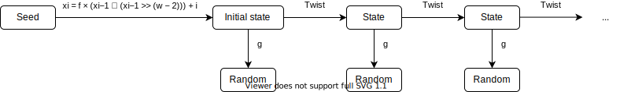

# APC-randomness


## True randomness and how to get it

Achieving true randomness is a hard, if not impossible, task to complete. To understand why it is so complex, we will take a look at some pseudo random number generators and learn more about how random these actually are.
We will look at multiple ways of generating random numbers, we will come to understand that most of these methods are not so random at all, and we will look at what we can do to improve and approach true randomness.

## Project use explanation

This project has an executable for each example, this way you can try different examples and compare their behaviour. For example, to run the std_rand example executable: go to the configuration drop-down in CLion and select `std_rand_example`.


## Different random number generating methods

Random number engines generate pseudo-random numbers using seed data as [entropy](https://en.wikipedia.org/wiki/Entropy) source. Several classes of pseudo-random number generation algorithms are implemented as templates that can be customized. 

The choice of which engine to use involves a number of tradeoffs: the linear congruential engine is moderately fast and has a very small storage requirement for state. The lagged Fibonacci generators are very fast even on processors without advanced arithmetic instruction sets, at the expense of greater state storage and sometimes less desirable spectral characteristics. The Mersenne twister is slower and has greater state storage requirements but with the right parameters has the longest non-repeating sequence with the most desirable spectral characteristics (for a given definition of desirable).

## RNG engine summary

| engine                                                                                      | name in `<random>`         | Speed     | Storage     | Characteristics                                       | Randomness comment                                                                                                |
|---------------------------------------------------------------------------------------------|----------------------------|-----------|-------------|-------------------------------------------------------|-------------------------------------------------------------------------------------------------------------------|
| [Linear Congruential](https://en.wikipedia.org/wiki/Linear_congruential_generator)          | linear_congruential_engine | 🔥        | very little | Fast and easy, highly configurable                    | Period length is parameter dependant, smaller initialization polynomials can reduce the period length drastically |
| [Mersenne Twister](https://en.wikipedia.org/wiki/Mersenne_Twister)                          | mersenne_twister_engine    | Moderate  | A lot       | "Damn"                                                | Period length is chosen to be a Mersenne prime                                                                    |
| [Subtract with carry / Lagged Fibonacci](https://en.wikipedia.org/wiki/Subtract_with_carry) | subtract_with_carry_engine | Very fast | Greater     | Also fast and easy, not meant for critical randomness | Maximum period of (2k − 1)×2M-1 or y = xk + xj + 1                                                                |

## In-depth overview of RNGs

### Linear Congruential

The linear congruential random number generation uses a piecewise linear function (AKA several linear formulas, the one being used is dependent on parameters provided to the function). For the LCG, this formula is the following:

X<sub>n+1</sub> = (a * X<sub>n</sub> + c) % m

where: 
- m: modulus
- a: multiplier
- c: increment
- X0: start value

Here's what that formula could look like as a Python function:
```py
from typing import Generator

def lcg(modulus: int, a: int, c: int, seed: int) -> Generator[int, None, None]:
    """Linear congruential generator."""
    # Returns a generator with pseudo-random numbers
    while True:
        seed = (a * seed + c) % modulus
        yield seed
```

Here is an example of the output of this function with different parameters:


Here is the output of the Linear congruential engine as generated in gradient_noise.cpp:


And here is a visualization of a 3D output in color and as a landscape where the gradient noise is used as a height map:


As becomes instantly clear from the gradient noise, this implementation of the linear congruential engine suffers from a lot of repetition.
This is not desirable, as when used in security applications, it may be easily cracked.

#### Example 1: `std::linear_congruential_engine`, see the code in linear_congruential.cpp

This code example demonstrates the built in `std::linear_congruential_engine` usage, and how it responds to different (or the same) seeds. You can try putting in different seeds to see the outcome of 7 seven dice roll outcomes with the `std::linear_congruential_engine` generating the dice outcome. To run this example, select the `linear_congruential_example` configuration.


### std::rand() (C++11)

std::rand() is likely the first Random Number Generator you will encounter when programming. std::rand() uses a simple, yet quite optimized implementation of a linear congruential engine.
The linear congruential engine, as most other engines, uses an algorithm to generate a number from the previous number in the array.
Because the algorithm uses the seed as the start value, we see that if we supply the generator with the same seed, it generates the same exact sequence of numbers everytime.

Here is the output of std::rand() as generated in gradient_noise.cpp:


And here is a visualization of a 3D output in color and as a landscape where the gradient noise is used as a height map:


As you can see, std::rand() does a pretty good job at generating random noise and a natural looking landscape.
As mentioned before, std::rand() is a version of the linear congruential engine. We can, however, see that it does a much better job on creating randomness than the implementation of the linear congruential engine above.
This is due to the fact that the linear congruential engine's implementation was a very bare-bones one, while std::rand() is about the most optimized version of the linear congruential engine.

#### Example 2: `std::rand()`, see the code in std_rand.cpp

In the example program you are asked to enter a value that will be used as the seed for the RNG.
If you play around with this a bit, you will see that the generated sequence of numbers will stay the same if you enter the same number for the seed again.
std::rand() is dependent on a different seed everytime to generate anything close to a random sequence.

This is the main drawback of all pseudo-random number generators. While they generate a fairly random output sequence,
they rely solely on getting a different seed everytime to stay random over time.
To make up for this drawback, the current system time of the machine running the program is used as the seed for the RNG.
This system time is the amount of seconds since january 1st, 1970. This insures that, unless the rand() function is called multiple times per second,
the output will always be different. To run this example, select the `std_rand_example` configuration.


### Lagged Fibonacci / Subtract with Carry

This generator is based on the [Fibonacci Sequence](https://en.wikipedia.org/wiki/Fibonacci_number) expression _F<sub>n</sub> = F<sub>n-1</sub> + F<sub>n - 2</sub>_ for _n > 1_ where _F<sub>0</sub> = 0_ and _F<sub>1</sub> = 1_.

When rewriting this expression to a [recurrence relation](https://en.wikipedia.org/wiki/Recurrence_relation) (a model describing the relation between states), we get to the following expression:

_S<sub>n</sub> = S<sub>n-1</sub> + S<sub>n - 2</sub>_

The subtract with carry random number generation method expands on this by subtracting a _cy(i-1)_ part and mods the output with M, so the equation looks like this:

`x(i) = (x(i - S) - x(i - R) - cy(i - 1)) % W where cy = 1 if x(i - S) - x(i - R) - cy(i - 1) < 0 else 0`

The variables in the formula describe the following:
- W: the word size, in bits, of the state sequence
- S: the short lag
- R: the long lag, where 0 < s < r

An example of values to use in the formula is `ranlux48_base`, these describe the subtract with carry as the following:

- W = 48
- S = 5
- R = 12

Here is the output of the Subtract With Carry engine as generated in gradient_noise.cpp:


Here is a visualization of the output of a Subtract with Carry random number generator in color and as a landscape.


As is visible from these images, there is still a lot of repetition in the gradient noise, but it is already a lot better than the linear congruential implementation.

#### Example 3: `std::subtract_with_carry_engine`, see the code in linear_congruential.cpp

This code example demonstrates the built in `std::subtract_with_carry_engine` usage, and how it responds to different (or the same) seeds. You can try putting in different seeds to see the outcome of 7 seven dice roll outcomes with the `std::subtract_with_carry_engine` generating the dice outcome.


### Mersenne Twister

The mersenne twister random number generator gets it name from using the Mersenne prime (2<sup>19937</sup> - 1) for calculating the next batch of random numbers. The math behind the Mersenne twister RNG is very abstract and probably beyond the scope of this overview. Nonetheless, we will try to give a basic explanation of the way this algorithm calculates random numbers.

#### Mersenne Twister Algorithm

To establish the initialization stage for the Mersenne Twister, we have to understand what this algorithm does. To visualize this, we made a high-level flow chart showing you the initialization stage and what happens after running the algorithm: 


After deciding on a seed, the initial Mersenne array can be calculated for an array of _n_ values of _w_ bits each. To initialize an array, you start with setting the value of x<sub>0</sub> to be your chosen seed, then you use the following formula to calculate the initial array:

_x<sub>i</sub> = f × (x<sub>i</sub>−1 ⊕ (x<sub>i</sub>−1 >> (w − 2))) + i_

Taking this formula into account in our flow-chart would look like this:



Now that there is an initialized array, we can apply our Mersenne twist onto it to get random numbers. This twist function looks like this:


Taking all of this into account, we get the following flow-chart:


After this, our array result is cascaded into one random number. This transformation looks like this:

y := x ⊕ ((x ≫ u) & d)

y := y ⊕ ((y ≪ s) & b)

y := y ⊕ ((y ≪ t) & c)

z := y ⊕ (y ≫ l)

In this transformation several variables to calculate a final `z`, `x` is the next value from the series, `y` a temporary value and `z` the value returned from the algorithm.

#### Mersenne Twister Coefficients

The behaviour of this twister and cascade is heavily decided by the parameters used, the parameters are described as following:

- w: word size (in number of bits)
- n: degree of recurrence
- m: middle word, an offset used in the recurrence relation defining the series x, 1 ≤ m < n
- r: separation point of one word, or the number of bits of the lower bitmask, 0 ≤ r ≤ w − 1
- a: coefficients of the rational normal form twist matrix
- b, c: TGFSR(R) tempering bitmasks
- s, t: TGFSR(R) tempering bit shifts
- u, d, l: additional Mersenne Twister tempering bit shifts/masks

Examples of these values (for example for MT19937-64):

- (w, n, m, r) = (64, 312, 156, 31)
- a = B5026F5AA96619E916
- (u, d) = (29, 555555555555555516)
- (s, b) = (17, 71D67FFFEDA6000016)
- (t, c) = (37, FFF7EEE00000000016)
- l = 43

Adding this to our flow-chart, we get a global overview of how we get from seed to random number:


An implementation of the Mersenne Twister algorithm in Python could look like [this](https://github.com/yinengy/Mersenne-Twister-in-Python/blob/master/MT19937.py):

```py
# coefficients for MT19937
(w, n, m, r) = (32, 624, 397, 31)
a = 0x9908B0DF
(u, d) = (11, 0xFFFFFFFF)
(s, b) = (7, 0x9D2C5680)
(t, c) = (15, 0xEFC60000)
l = 18
f = 1812433253


# make an array to store the state of the generator
MT = [0 for i in range(n)]
index = n+1
lower_mask = 0x7FFFFFFF #(1 << r) - 1 // That is, the binary number of r 1's
upper_mask = 0x80000000 #lowest w bits of (not lower_mask)


# initialize the generator from a seed
def mt_seed(seed):
    # global index
    # index = n
    MT[0] = seed
    for i in range(1, n):
        temp = f * (MT[i-1] ^ (MT[i-1] >> (w-2))) + i
        MT[i] = temp & 0xffffffff


# Extract a tempered value based on MT[index]
# calling twist() every n numbers
def extract_number():
    global index
    if index >= n:
        twist()
        index = 0

    y = MT[index]
    y = y ^ ((y >> u) & d)
    y = y ^ ((y << s) & b)
    y = y ^ ((y << t) & c)
    y = y ^ (y >> l)

    index += 1
    return y & 0xffffffff


# Generate the next n values from the series x_i
def twist():
    for i in range(0, n):
        x = (MT[i] & upper_mask) + (MT[(i+1) % n] & lower_mask)
        xA = x >> 1
        if (x % 2) != 0:
            xA = xA ^ a
        MT[i] = MT[(i + m) % n] ^ xA


if __name__ == '__main__':
    mt_seed(0)
    print(extract_number())

```


Here is the output of the Mersenne twister engine as generated in gradient_noise.cpp:


And here is a visualization of a 3D output in color and as a landscape where the gradient noise is used as a height map:


Now we are getting somewhere. These images show a nicely generated gradient noise with no distinct patterns or repetition.


#### Example 4: `std::mersenne_twister_engine`, see the code in mersenne_twister.cpp

This code example demonstrates the built in `std::mersenne_twister_engine` usage, and how it responds to different (or the same) seeds. You can try putting in different seeds to see the outcome of 7 seven dice roll outcomes with the `std::mersenne_twister_engine` generating the dice outcome. To run this example, select the `mersenne_twister_example` configuration.

Sadly we have still not achieved true randomness. All the engines above are still dependent on a single seed value.
If we want to use these RNGs for anything more than pretty landscapes, we will have to do better. 


## Cryptographically strong random number generators

All the aforementioned random number generators above have one common flaw: they are based on a linear/recurring change of the internal state. With enough time and testing, you could predict what the next or previous value will be. 

Let's put this into an example where we can understand why random numbers are so important; If we want to use the internet securely, we need to generate numbers used for encrypting and decrypting data between two people (or two servers) on the internet. If the method of generating these random numbers used to encrypt our data is flawed (or easily to reverse), people (or, again, servers) could steal crucial data like credit card information, medical data or our most private secrets. This is of course not what we want and why we don't use pseudo-random number generators where real randomness is critical. 

Instead of using pseudo-random random number generators, we use cryptographically strong random number generators, or CSPRNG for short. Cryptographically strong random number generators can generate numbers just as a pseudo-random number generator can, but a pseudo-random number generator cannot generate the same quality of random numbers as a cryptographically strong number generator could. 
Most of these CSPRNGs obtain their original seed from the operating system's randomness API, which ensures a high entropy. 
The CSPRNG is also often re-seeded to avoid hackers from being able to obtain the original seed by means of reverse engineering.
With these methods the CSPRNG closely approaches true randomness and is safe enough to be used in high-end encryption.


## Hardware random number generators

We have come a long way from the linear congruential engine and have almost achieved true randomness. However, since in the field of programming we're bound to computer's logic and algorithms, generating true random numbers is near impossible.
To achieve true randomness, we need move over to hardware, and even step into the realm of quantum physics.

Hardware random number generators generally make use of a transducer to convert an aspect of a physical phenomenon to an electrical signal, an amplifier to increase the random fluctuations to a measurable level,
and an analog to digital converter to convert the signal to a digital value, so it can be used in further processing by digital devices.
The two most used types of phenomena in hardware RNGs are quantum mechanics at atomic or subatomic level and thermal noise(which has part of its origin in the quantum field).

Measuring the fluctuations in these processes and using them to generate sequences of numbers, we can finally achieve true randomness.

### Sources

- https://en.cppreference.com/w/cpp/numeric/random/subtract_with_carry_engine
- https://en.wikipedia.org/wiki/Subtract_with_carry
- https://en.wikipedia.org/wiki/Mersenne_Twister
- https://en.wikipedia.org/wiki/Lagged_Fibonacci_generator
- https://en.wikipedia.org/wiki/Modulo_operation#Performance_issues
- https://en.wikipedia.org/wiki/Cryptographically-secure_pseudorandom_number_generator
- https://en.wikipedia.org/wiki/Hardware_random_number_generator
- https://en.cppreference.com/w/cpp/numeric/random/mersenne_twister_engine
- https://en.cppreference.com/w/cpp/numeric/random/subtract_with_carry_engine